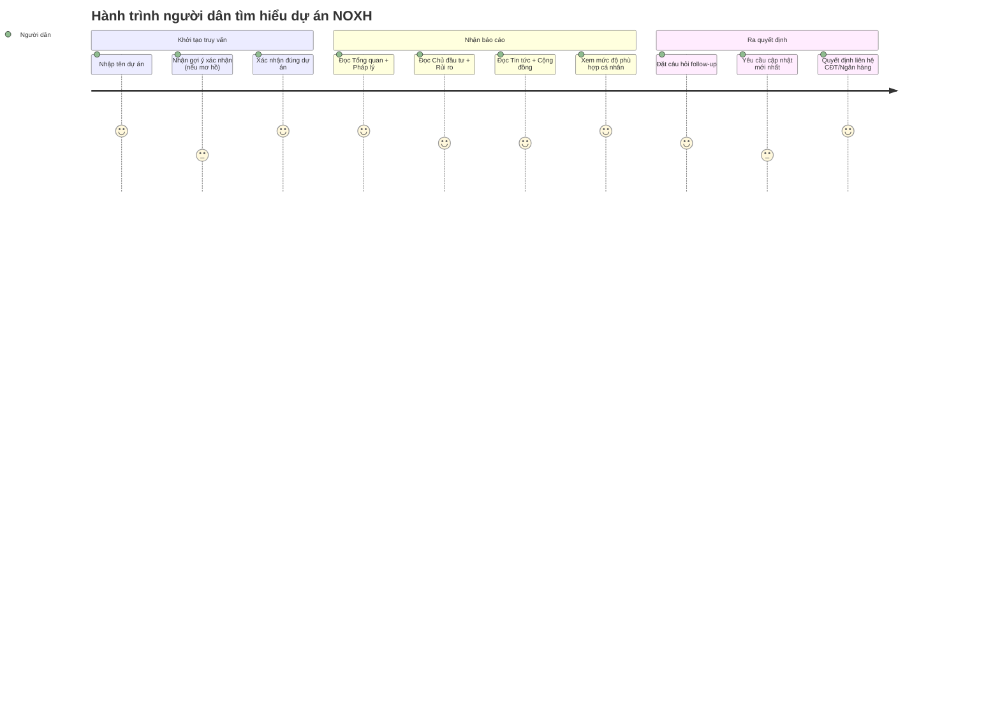
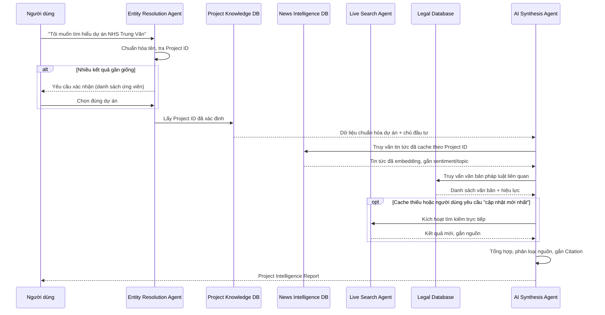
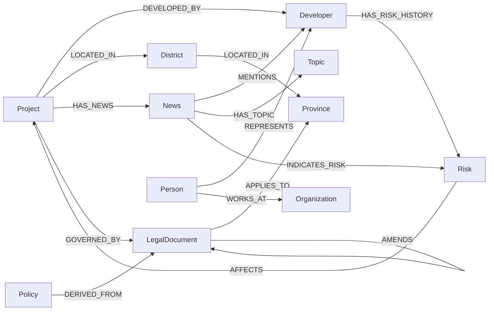
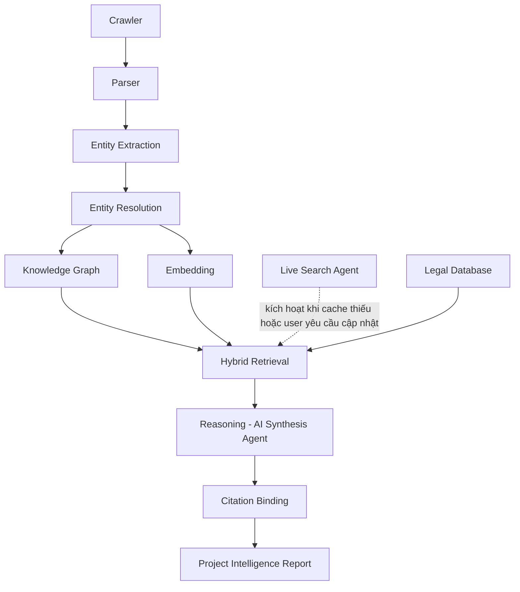
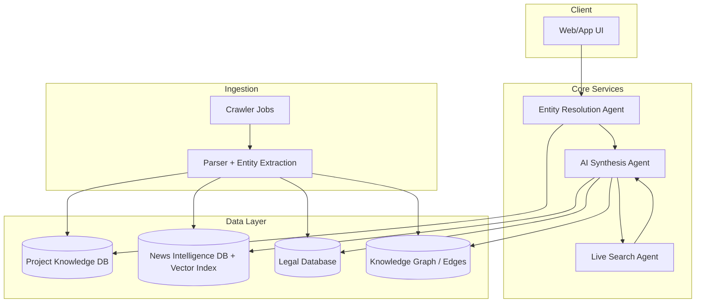

# PROJECT INTELLIGENCE — NOXH Copilot
## Solution Design Document (BRD + Technical Design)

| | |
|---|---|
| **Sản phẩm** | NOXH Copilot – AI Legal Intelligence Platform |
| **Module** | Project Intelligence Report |
| **Loại tài liệu** | Business Requirement Document + Solution Design |
| **Đối tượng đọc** | Product, BA, Backend Engineer, AI Engineer, Data Engineer |
| **Trạng thái** | Draft v1.0 — sẵn sàng triển khai Hackathon 48h |
| **Ngày** | 2026-07-18 |

> **Nguyên tắc thiết kế cốt lõi:** Đây không phải chatbot tìm kiếm thông tin. Đây là một AI Agent làm nhiệm vụ **Decision Support** — tổng hợp dữ liệu đa nguồn (Knowledge Graph + News DB + Live Search + Legal DB) thành một báo cáo có cấu trúc, có trích dẫn, giúp người dân ra quyết định về một dự án Nhà ở xã hội (NOXH) cụ thể.

---

## 1. Mục tiêu

### 1.1 Business Goal

Xây dựng module **Project Intelligence** cho phép người dùng nhập tên một dự án NOXH (ví dụ: "NHS Trung Văn") và nhận về một **Project Intelligence Report** — báo cáo tổng hợp đa chiều (pháp lý, tiến độ, chủ đầu tư, tin tức, rủi ro, mức độ phù hợp) thay vì một câu trả lời tìm kiếm đơn thuần.

Module này là năng lực cốt lõi giúp NOXH Copilot khác biệt với các trợ lý tổng quát (Gemini, NotebookLM): nó không chỉ đọc và tóm tắt, mà **liên kết thực thể, đối chiếu nguồn, phân loại độ tin cậy, và hỗ trợ ra quyết định có kiểm chứng**.

### 1.2 Problem Statement

Người dân muốn mua/đăng ký NOXH hiện phải tự đi tìm và ghép nối thông tin từ nhiều nguồn rời rạc: báo chí, website chủ đầu tư, cổng thông tin Bộ Xây dựng, mạng xã hội, văn bản pháp luật. Không có nguồn nào tổng hợp sẵn theo dự án, không ai đối chiếu chéo giữa "chủ đầu tư nói gì" và "báo chí/cộng đồng nói gì", và không có công cụ nào gắn kết dữ liệu dự án với các thay đổi chính sách/pháp lý đang diễn ra. Hệ quả: người dân ra quyết định dựa trên thông tin rời rạc, thiên lệch hoặc lỗi thời — rủi ro tài chính và pháp lý là rất lớn với một quyết định mua nhà.

### 1.3 Success Metrics

| Nhóm | Chỉ số | Mục tiêu MVP (Hackathon) | Mục tiêu Production |
|---|---|---|---|
| Chất lượng trả lời | Tỷ lệ report có Citation đầy đủ (không có claim "trôi nổi") | 100% | 100% |
| Độ chính xác | Tỷ lệ Entity Resolution đúng dự án ở lần hỏi đầu | ≥ 80% | ≥ 95% |
| Độ phủ | Số dự án NOXH có trong Knowledge Base | ≥ 20 dự án demo | Toàn bộ dự án đã công bố tại các tỉnh mục tiêu |
| Hiệu năng | Latency sinh report (cache hit) | < 8s | < 3s |
| Hiệu năng | Latency sinh report (cần Live Search) | < 30s | < 15s |
| Tin cậy | Tỷ lệ report bị người dùng gắn cờ "sai lệch/gây hiểu nhầm" | Theo dõi thủ công | < 1% |
| Business | Tỷ lệ người dùng thực hiện hành động tiếp theo (liên hệ CĐT/ngân hàng) sau khi đọc report | Theo dõi thủ công | ≥ 15% |

---

## 2. Đối tượng sử dụng

| Đối tượng | Nhu cầu chính | Mức độ ưu tiên trong MVP |
|---|---|---|
| **Người dân** (người mua/đăng ký NOXH) | Đánh giá tổng thể dự án trước khi đăng ký/đặt cọc: pháp lý, tiến độ, uy tín CĐT, rủi ro, mức độ phù hợp với điều kiện cá nhân | ★★★ Ưu tiên cao nhất — persona chính của MVP |
| **Ngân hàng** (thẩm định cho vay mua NOXH) | Tra cứu nhanh tình trạng pháp lý, tiến độ xây dựng, lịch sử tranh chấp của dự án làm tài sản đảm bảo | ★★ Phase 2 — dùng chung report engine, thêm view thẩm định |
| **Chủ đầu tư** | Theo dõi thông tin/tin tức về chính dự án của mình, phát hiện tin sai lệch cần đính chính | ★ Phase 2 — cần thêm quyền xác thực danh tính CĐT |
| **Cơ quan quản lý** | Giám sát tổng hợp tình trạng pháp lý, tiến độ, khiếu nại trên diện rộng nhiều dự án/tỉnh | ★ Phase 2/3 — cần dashboard tổng hợp riêng, không nằm trong scope Hackathon |

---

## 3. Hiện trạng

### 3.1 Người dân hiện tìm thông tin như thế nào?

Quy trình thủ công điển hình: tìm tên dự án trên Google → đọc vài bài báo rời rạc → vào website/fanpage chủ đầu tư (thông tin một chiều, thiên vị) → hỏi trong các hội nhóm Facebook/diễn đàn (thông tin không kiểm chứng, dễ nhiễu) → tự tra cứu văn bản pháp luật liên quan (khó đọc, khó biết văn bản nào còn hiệu lực) → tự ghép nối và tự đánh giá rủi ro, không có công cụ hỗ trợ đối chiếu.

### 3.2 Pain Points

| # | Pain Point | Hệ quả |
|---|---|---|
| 1 | Thông tin rời rạc trên nhiều nguồn, không ai tổng hợp theo dự án | Tốn thời gian, dễ bỏ sót thông tin quan trọng |
| 2 | Không phân biệt được nguồn tin chính thống, báo chí, tin đồn | Ra quyết định dựa trên thông tin sai/thiên lệch |
| 3 | Không biết chủ đầu tư có lịch sử tranh chấp/chậm tiến độ ở dự án khác không | Rủi ro tài chính nếu CĐT không uy tín |
| 4 | Không cập nhật được thay đổi chính sách pháp lý ảnh hưởng đến dự án đang quan tâm | Ra quyết định dựa trên quy định đã hết hiệu lực |
| 5 | Không có công cụ đối chiếu điều kiện cá nhân (thu nhập, hộ khẩu, đối tượng ưu tiên) với điều kiện của từng dự án | Đăng ký nhầm dự án không đủ điều kiện |

### 3.3 Gemini / NotebookLM chưa giải quyết được gì?

| Khả năng | Gemini (Live Search tổng quát) | NotebookLM (tóm tắt tài liệu người dùng cung cấp) | NOXH Copilot cần làm |
|---|---|---|---|
| Nhận diện đúng dự án khi tên viết tắt/gần giống | Không — trả lời theo truy vấn text đơn thuần, dễ nhầm "Ecohome" với nhiều dự án cùng tên | Không áp dụng — người dùng phải tự cung cấp đúng tài liệu | Entity Resolution Agent có xác nhận với người dùng |
| Liên kết dữ liệu dự án ⇄ chủ đầu tư ⇄ tranh chấp ở dự án khác | Không có Knowledge Graph, không liên kết thực thể xuyên nguồn | Không — chỉ làm việc trong phạm vi tài liệu upload | Knowledge Graph liên kết Project–Developer–News–Legal |
| Phân loại độ tin cậy nguồn (chính thống vs. tin đồn) | Không phân loại, trộn lẫn kết quả tìm kiếm | Không áp dụng | Gắn nhãn nguồn + độ tin cậy cho từng claim |
| Theo dõi thay đổi pháp lý có liên quan đến dự án cụ thể | Không — trả lời pháp luật chung chung, không gắn với dự án | Không | Legal Intelligence liên kết văn bản pháp luật với dự án |
| Đánh giá mức độ phù hợp cá nhân hoá | Không | Không | Suitability Analysis theo hồ sơ người dùng |
| Citation ở mức claim, phân tách chính thống/báo chí/cộng đồng/AI suy luận | Trích nguồn chung chung, không phân tầng | Có citation nhưng chỉ trong phạm vi tài liệu đã upload | Citation bắt buộc, phân tầng 4 loại nguồn (mục 11) |

**Kết luận:** Gemini và NotebookLM đều là công cụ tổng quát — mạnh về tìm kiếm/tóm tắt nhưng không có mô hình dữ liệu chuyên biệt cho miền NOXH (không có Project Knowledge Graph, không phân tầng độ tin cậy, không gắn kết pháp lý theo dự án). NOXH Copilot không cạnh tranh về khả năng ngôn ngữ chung, mà thắng bằng **domain data model + grounding + decision framing**.

---

## 4. Future State

### 4.1 Trải nghiệm tương lai (tóm tắt)

Người dân gõ "Tôi muốn tìm hiểu dự án NHS Trung Văn". Nếu tên khớp duy nhất, hệ thống trả về report trong vài giây (cache) hoặc vài chục giây (cần tra cứu mới). Nếu tên mơ hồ (ví dụ "Ecohome"), hệ thống hỏi lại để xác nhận dự án cụ thể trước khi tổng hợp. Report luôn có cấu trúc cố định (mục 10), luôn có Citation, luôn phân biệt rõ nhận định nào là dữ liệu chính thống, nhận định nào là AI suy luận. Người dùng có thể hỏi tiếp ("Dự án này có phù hợp với tôi không nếu tôi ở Hà Nội, thu nhập 12 triệu/tháng?") và hệ thống trả lời trong ngữ cảnh của report đã sinh.

### 4.2 User Journey

### 4.3 AI Journey (luồng xử lý nội bộ)

---

## 5. Functional Requirement

| ID | Tên yêu cầu | Mô tả | Input | Output | Ưu tiên |
|---|---|---|---|---|---|
| **FR-01** | Entity Resolution | Chuẩn hóa tên dự án người dùng nhập, tra cứu Project ID trong Project Knowledge DB. Nếu có nhiều kết quả gần giống (fuzzy match trên tên + alias), phải liệt kê ứng viên và yêu cầu người dùng xác nhận trước khi tiếp tục | Tên dự án (free text) | Project ID đã xác nhận (hoặc danh sách ứng viên) | Bắt buộc — MVP |
| **FR-02** | Project Search | Tìm kiếm dự án theo tên, địa phương, chủ đầu tư, trạng thái pháp lý; hỗ trợ tìm gần đúng | Từ khóa, bộ lọc | Danh sách dự án khớp | Bắt buộc — MVP |
| **FR-03** | Project Intelligence | Tổng hợp dữ liệu chuẩn hóa của dự án: vị trí, quy mô, tiến độ, thời điểm mở bán/đăng ký | Project ID | Khối "Tổng quan dự án" trong report | Bắt buộc — MVP |
| **FR-04** | Developer Intelligence | Tổng hợp thông tin chủ đầu tư: lịch sử dự án đã triển khai, tình trạng pháp lý doanh nghiệp, lịch sử chậm tiến độ/tranh chấp ở các dự án khác (liên kết qua Knowledge Graph) | Developer ID | Khối "Chủ đầu tư" trong report | Bắt buộc — MVP |
| **FR-05** | News Intelligence | Truy xuất tin tức đã crawl/embedding liên quan đến dự án, phân loại sentiment (tích cực/tiêu cực/trung lập) và topic (pháp lý, tiến độ, giá bán, tranh chấp...) | Project ID, Developer ID | Khối "Tin tích cực" / "Tin cần lưu ý" | Bắt buộc — MVP |
| **FR-06** | Legal Intelligence | Truy xuất văn bản pháp luật liên quan đến loại hình NOXH và địa phương của dự án; kiểm tra hiệu lực; phát hiện thay đổi chính sách gần đây có ảnh hưởng | Project ID, Province | Khối "Pháp lý" + "Thay đổi pháp lý liên quan" | Bắt buộc — MVP |
| **FR-07** | Risk Detection | Phát hiện tín hiệu rủi ro từ News DB + Legal DB + Developer history: chậm tiến độ, tranh chấp, thay đổi quy hoạch, vi phạm xây dựng | Project ID, Developer ID | Khối "Rủi ro / Tin cần lưu ý" (có mức độ: Thấp/Trung bình/Cao) | Bắt buộc — MVP |
| **FR-08** | Suitability Analysis | Đối chiếu điều kiện dự án (đối tượng ưu tiên, mức giá, điều kiện hộ khẩu/thu nhập theo quy định) với hồ sơ người dùng cung cấp | Project ID + hồ sơ người dùng (tùy chọn) | Khối "Mức độ phù hợp với người dùng" | MVP rút gọn (cần người dùng chủ động cung cấp hồ sơ) |
| **FR-09** | Citation | Mọi claim trong report phải gắn nguồn cụ thể (link/văn bản/ngày crawl) và loại nguồn (chính thống/báo chí/cộng đồng/AI suy luận) | Toàn bộ dữ liệu tổng hợp | Danh sách Citation kèm report | Bắt buộc — MVP, không thương lượng |
| **FR-10** | Follow-up Question | Cho phép người dùng hỏi tiếp trong ngữ cảnh report đã sinh (ví dụ hỏi sâu về pháp lý, so sánh với dự án khác) mà không mất ngữ cảnh Project ID đã xác định | Câu hỏi follow-up + report context | Câu trả lời có Citation, giữ nguyên Project ID | Bắt buộc — MVP |

---

## 6. Non-Functional Requirement

| Nhóm | Yêu cầu | Ngưỡng MVP | Ngưỡng Production |
|---|---|---|---|
| **Performance** | Thời gian sinh report khi dữ liệu đã có trong cache | < 8s | < 3s |
| **Latency** | Thời gian khi cần kích hoạt Live Search Agent | < 30s, có streaming trạng thái xử lý | < 15s |
| **Accuracy** | Tỷ lệ Entity Resolution đúng dự án | ≥ 80% | ≥ 95% |
| **Grounding** | Mọi kết luận trong report phải bắt nguồn từ dữ liệu đã truy xuất (không hallucinate); AI Synthesis Agent không được tự suy diễn ngoài phạm vi dữ liệu có Citation | Bắt buộc | Bắt buộc + kiểm thử tự động (grounding eval) |
| **Citation** | 100% claim quan trọng (pháp lý, rủi ro, chủ đầu tư) phải có nguồn kèm theo | Bắt buộc | Bắt buộc + audit log truy vết nguồn |
| **Security** | Không lưu thông tin cá nhân người dùng (hồ sơ thu nhập, hộ khẩu) ngoài phạm vi phiên làm việc trừ khi người dùng đồng ý lưu | Áp dụng ngay từ MVP | + mã hóa at-rest, phân quyền theo vai trò |
| **Audit** | Ghi log mọi report đã sinh: nguồn dữ liệu dùng, thời điểm crawl, phiên bản văn bản pháp luật tham chiếu | Log cơ bản (file/DB) | Audit trail đầy đủ, truy vết theo yêu cầu pháp lý |

---

## 7. Nguồn dữ liệu

### 7.1 Dữ liệu chuẩn hóa (Structured)

| Nguồn | Nội dung | Độ tin cậy | Tần suất cập nhật | Cách thu thập | Cache? |
|---|---|---|---|---|---|
| Danh mục dự án NOXH | Tên, vị trí, quy mô, chủ đầu tư, thời điểm mở bán | Cao (nếu từ cổng thông tin chính thức) | Theo đợt công bố (không thường xuyên) | Nhập tay/crawl có kiểm duyệt từ cổng Sở Xây dựng địa phương | Có — cache dài hạn, refresh theo lịch |
| Danh mục chủ đầu tư | Tên pháp nhân, mã số doanh nghiệp, lịch sử dự án | Cao | Thấp | Đối chiếu cổng thông tin doanh nghiệp quốc gia | Có |
| Văn bản pháp luật (Luật Nhà ở, Nghị định, Thông tư liên quan NOXH) | Toàn văn + hiệu lực + phạm vi áp dụng | Rất cao (nguồn chính thống) | Theo đợt ban hành/sửa đổi | Crawl Cổng Thông tin điện tử Chính phủ + Cơ sở dữ liệu quốc gia về pháp luật | Có — bắt buộc versioning theo hiệu lực |

### 7.2 Dữ liệu bán cấu trúc (Semi-structured)

| Nguồn | Nội dung | Độ tin cậy | Tần suất cập nhật | Cách thu thập | Cache? |
|---|---|---|---|---|---|
| Báo chí | Bài viết về tiến độ, giá bán, tranh chấp | Trung bình–Cao (tùy tòa soạn) | Hàng ngày | Crawler + RSS, gắn nhãn nguồn báo | Có — cache + refresh incremental |
| Website chủ đầu tư | Thông tin dự án do CĐT công bố (một chiều) | Trung bình (thông tin có thể thiên vị) | Không đều | Crawl định kỳ | Có — gắn nhãn rõ "nguồn: chủ đầu tư" |
| Website Bộ Xây dựng / Sở Xây dựng | Thông báo chính thức, danh sách dự án đủ điều kiện | Rất cao | Theo đợt | Crawl định kỳ + parser theo cấu trúc trang | Có |
| Cổng thông tin Chính phủ | Văn bản, thông cáo báo chí chính sách | Rất cao | Theo sự kiện | Crawl + theo dõi thay đổi (diff) | Có |

### 7.3 Dữ liệu động (Dynamic / Unverified)

| Nguồn | Nội dung | Độ tin cậy | Tần suất cập nhật | Cách thu thập | Cache? |
|---|---|---|---|---|---|
| Facebook (hội nhóm, fanpage) | Thảo luận, phản ánh của cư dân/người đăng ký | Thấp — cần gắn nhãn "chưa kiểm chứng" | Liên tục | Không crawl trực tiếp nếu vi phạm ToS; ưu tiên qua Live Search Agent khi được phép | Không cache dài hạn — chỉ cache tạm thời trong phiên |
| Diễn đàn/Group chat | Ý kiến cộng đồng, cảnh báo rủi ro truyền miệng | Thấp | Liên tục | Live Search theo yêu cầu | Không cache dài hạn |
| Tin mới nhất (breaking news) | Tin vừa xảy ra, chưa qua News Intelligence pipeline | Trung bình — cần xác minh chéo | Theo thời gian thực | Live Search Agent khi người dùng yêu cầu "cập nhật mới nhất" | Không — luôn truy vấn mới, sau đó nạp vào News DB nếu xác thực được |

> **Decision (Nguồn dữ liệu):** MVP Hackathon chỉ crawl chọn lọc báo chí uy tín + cổng thông tin chính thống. Dữ liệu mạng xã hội/diễn đàn KHÔNG được lưu trữ lâu dài trong pipeline chính — chỉ truy xuất qua Live Search theo yêu cầu và luôn gắn nhãn "thông tin cộng đồng, chưa kiểm chứng" để tránh rủi ro pháp lý và rủi ro lan truyền tin sai lệch.

---

## 8. Knowledge Graph

### 8.1 Thiết kế Node

| Node | Thuộc tính chính |
|---|---|
| **Project** | project_id, name, aliases[], address, district_id, province_id, legal_status, construction_status, scale (số căn/diện tích), launch_time, developer_id |
| **Developer** | developer_id, legal_name, tax_code, founded_year, project_ids[] |
| **Province** | province_id, name |
| **District** | district_id, name, province_id |
| **LegalDocument** | doc_id, title, doc_type (Luật/Nghị định/Thông tư/Quyết định), issued_date, effective_date, expired_date, applies_to_province[], applies_to_project_type |
| **News** | news_id, title, url, published_date, source_name, source_tier (chính thống/báo chí/cộng đồng), sentiment, topic[], crawled_at |
| **Topic** | topic_id, name (ví dụ: Tiến độ, Giá bán, Tranh chấp, Pháp lý, Bàn giao) |
| **Risk** | risk_id, risk_type (chậm tiến độ/tranh chấp/vi phạm xây dựng/thay đổi quy hoạch), severity, detected_from_news_ids[], detected_at |
| **Policy** | policy_id, name, summary, effective_date, related_legal_doc_ids[] |
| **Person** | person_id, name, role (đại diện pháp luật, lãnh đạo CĐT...) |
| **Organization** | org_id, name, org_type (CĐT, ngân hàng bảo lãnh, cơ quan quản lý...) |

### 8.2 Thiết kế Relationship

| Quan hệ | Từ → Đến | Ý nghĩa |
|---|---|---|
| `LOCATED_IN` | Project → District → Province | Vị trí địa lý |
| `DEVELOPED_BY` | Project → Developer | Chủ đầu tư dự án |
| `HAS_NEWS` | Project → News | Tin tức liên quan trực tiếp đến dự án |
| `MENTIONS` | News → Developer / Project / Person | Thực thể được nhắc đến trong tin |
| `HAS_TOPIC` | News → Topic | Phân loại chủ đề tin tức |
| `INDICATES_RISK` | News → Risk | Tin tức là bằng chứng cho một tín hiệu rủi ro |
| `AFFECTS` | Risk → Project | Rủi ro ảnh hưởng đến dự án nào |
| `HAS_RISK_HISTORY` | Developer → Risk | Lịch sử rủi ro liên quan đến chủ đầu tư (có thể ở dự án khác) |
| `GOVERNED_BY` | Project → LegalDocument | Văn bản pháp luật áp dụng cho dự án |
| `APPLIES_TO` | LegalDocument → Province / District | Phạm vi áp dụng của văn bản |
| `AMENDS` / `REPLACES` | LegalDocument → LegalDocument | Lịch sử sửa đổi/thay thế văn bản (quan trọng để biết văn bản còn hiệu lực) |
| `DERIVED_FROM` | Policy → LegalDocument | Chính sách được ban hành dựa trên văn bản nào |
| `WORKS_AT` | Person → Organization | Người đại diện thuộc tổ chức nào |
| `REPRESENTS` | Person → Developer | Người đại diện pháp luật của CĐT |

> **Decision (Knowledge Graph engine):** MVP Hackathon dùng mô hình quan hệ (PostgreSQL) mô phỏng graph bằng bảng `edges(from_id, to_id, relation_type, metadata)` để giảm rủi ro hạ tầng trong 48h. Migrate sang Neo4j/Amazon Neptune ở Phase 2 khi số lượng quan hệ và nhu cầu truy vấn đa hop tăng lên.

---

## 9. AI Pipeline

| Giai đoạn | Chức năng | Công nghệ đề xuất (MVP) |
|---|---|---|
| Crawler | Thu thập báo chí, cổng thông tin chính thống theo lịch | Scrapy/Playwright + RSS feed |
| Parser | Chuẩn hóa HTML → text sạch, trích metadata (ngày, tác giả, nguồn) | trafilatura/BeautifulSoup |
| Entity Extraction | Nhận diện tên dự án, chủ đầu tư, địa phương, số liệu trong văn bản | LLM extraction (structured output) + regex cho số liệu |
| Entity Resolution | Khớp thực thể trích xuất với Project ID/Developer ID đã có; xử lý alias, viết tắt | Fuzzy matching (embedding similarity + string similarity) |
| Knowledge Graph | Lưu quan hệ đã resolve | PostgreSQL (edges table) → Neo4j (Phase 2) |
| Embedding | Vector hóa nội dung tin tức/văn bản để tìm kiếm ngữ nghĩa | Text embedding model + pgvector |
| Hybrid Retrieval | Kết hợp truy vấn Graph (quan hệ) + Vector search (ngữ nghĩa) + filter theo Project ID | pgvector + SQL join theo Project ID |
| Reasoning | AI Synthesis Agent tổng hợp, phân loại nguồn, đối chiếu chéo | LLM (Claude) với structured prompt, tách rõ vai trò từng loại dữ liệu |
| Citation | Gắn nguồn cho từng claim trước khi trả về | Post-processing bắt buộc, reject output nếu thiếu citation |
| Report | Sinh Project Intelligence Report theo template cố định (mục 10) | Template-based rendering, không để LLM tự do định dạng |

---

## 10. Project Intelligence Report — Cấu trúc

| # | Mục | Nội dung | Nguồn dữ liệu | Bắt buộc Citation |
|---|---|---|---|---|
| 1 | Tổng quan dự án | Vị trí, quy mô, loại hình, thời điểm mở bán/đăng ký | Project Knowledge DB | Có |
| 2 | Chủ đầu tư | Tên pháp nhân, lịch sử dự án đã triển khai, tín hiệu uy tín/rủi ro từ dự án khác | Knowledge Graph + News DB | Có |
| 3 | Tiến độ | Trạng thái xây dựng hiện tại, so sánh với kế hoạch công bố | Project Knowledge DB + News DB | Có |
| 4 | Pháp lý | Tình trạng pháp lý dự án (đã được duyệt/đang chờ/vướng mắc), văn bản áp dụng | Legal Database | Có |
| 5 | Tin tích cực | Tin tức có sentiment tích cực liên quan (bàn giao đúng hạn, được vinh danh...) | News Intelligence DB | Có |
| 6 | Tin cần lưu ý | Tin tức có sentiment tiêu cực/cảnh báo (chậm tiến độ, khiếu nại, vi phạm) | News Intelligence DB | Có |
| 7 | Thảo luận cộng đồng | Tổng hợp có chọn lọc ý kiến từ diễn đàn/mạng xã hội, gắn nhãn "chưa kiểm chứng" | Live Search Agent (khi được kích hoạt) | Có, kèm nhãn độ tin cậy thấp |
| 8 | Các thay đổi pháp lý liên quan | Văn bản/chính sách mới ban hành có ảnh hưởng đến dự án hoặc loại hình NOXH này | Legal Database | Có |
| 9 | Đánh giá AI | Nhận định tổng hợp của AI Synthesis Agent — **luôn gắn nhãn rõ "Đây là suy luận của AI, không phải kết luận chính thức"** | AI Synthesis Agent (suy luận có căn cứ) | Có — trích các mục 1–8 làm căn cứ |
| 10 | Mức độ phù hợp với người dùng | Đối chiếu điều kiện dự án với hồ sơ người dùng cung cấp (nếu có) | Suitability Analysis (FR-08) | Có |
| 11 | Citation | Danh sách đầy đủ nguồn đã dùng: link, loại nguồn, thời điểm crawl/truy vấn | Toàn bộ pipeline | — (chính là phần Citation) |

---

## 11. AI Safety

### 11.1 Nguyên tắc bắt buộc

AI Synthesis Agent **không được tự kết luận** thay người dùng. Mọi output phải phân tầng rõ 4 loại thông tin và không được trộn lẫn:

| Loại thông tin | Định nghĩa | Cách hiển thị trong report |
|---|---|---|
| **Thông tin chính thống** | Từ Legal Database, cổng thông tin Chính phủ/Bộ Xây dựng/Sở Xây dựng | Nhãn "Nguồn chính thống" + link văn bản |
| **Thông tin báo chí** | Từ News Intelligence DB, các tòa soạn đã crawl | Nhãn "Theo báo [Tên báo], ngày [x]" |
| **Thông tin cộng đồng** | Từ Live Search vào Facebook/diễn đàn | Nhãn "Thảo luận cộng đồng — chưa kiểm chứng" |
| **Thông tin AI suy luận** | Nhận định tổng hợp của Synthesis Agent dựa trên 3 loại trên | Nhãn "Đánh giá của AI dựa trên [danh sách nguồn]" — không bao giờ đứng một mình không có căn cứ |

### 11.2 Quy tắc cứng (Hard Rule)

Mọi kết luận phải có Citation. Nếu AI Synthesis Agent không tìm được nguồn cho một claim, claim đó **không được đưa vào report** — thà thiếu thông tin còn hơn bịa thông tin (grounding-first, không completeness-first). Output không có Citation phải bị chặn ở bước post-processing (Citation Binding trong pipeline mục 9), không phải chỉ dựa vào prompt instruction.

### 11.3 Risk liên quan AI Safety

| Risk | Mức độ | Biện pháp giảm thiểu |
|---|---|---|
| LLM tự suy diễn/hallucinate thông tin pháp lý | Cao | Bắt buộc grounding: mỗi câu trong mục Pháp lý phải trích dẫn `doc_id` cụ thể; validate bằng rule-based check trước khi trả về |
| Trộn lẫn tin đồn cộng đồng với thông tin chính thống khiến người dùng hiểu nhầm là đã kiểm chứng | Cao | Bắt buộc nhãn nguồn hiển thị ngay đầu mỗi đoạn, không gộp chung định dạng |
| Report bị dùng để quảng cáo/thiên vị một dự án (do dữ liệu website CĐT chiếm ưu thế) | Trung bình | Cân bằng nguồn: ưu tiên hiển thị tin báo chí/pháp lý độc lập song song với thông tin do CĐT công bố, gắn rõ nhãn "nguồn: chủ đầu tư" |
| Thông tin cá nhân người dùng (thu nhập, hộ khẩu) bị dùng sai mục đích | Cao | Không lưu trữ ngoài phiên làm việc trừ khi có consent rõ ràng; xem NFR Security mục 6 |

---

## 12. Kiến trúc triển khai

### 12.1 MVP (Hackathon 48h)

| Thành phần | Lựa chọn kỹ thuật | Lý do |
|---|---|---|
| Database | PostgreSQL + pgvector (một instance duy nhất) | Giảm rủi ro hạ tầng, đủ cho Graph mô phỏng + Vector search |
| Knowledge Graph | Bảng `edges` trong PostgreSQL | Không cần triển khai Neo4j trong 48h |
| Crawler | Script crawl thủ công/bán tự động cho ~20 dự án demo, chạy 1 lần trước Demo Day | Đủ để chứng minh concept, không cần pipeline realtime |
| Entity Resolution | Fuzzy string match + danh sách alias nhập tay cho demo | Đơn giản, đủ chính xác cho tập dữ liệu nhỏ |
| Live Search | Gọi API tìm kiếm web có sẵn (không tự xây crawler cộng đồng) | Tiết kiệm thời gian, tập trung vào Synthesis Agent |
| AI Synthesis | 1 LLM call có structured prompt + citation binding post-process | Trọng tâm demo giá trị cốt lõi |
| Report rendering | Template cố định (markdown/HTML) | Đảm bảo Citation không bị AI tự ý bỏ qua |

### 12.2 Phase 2

| Thành phần | Nâng cấp |
|---|---|
| Knowledge Graph | Migrate sang Neo4j/Neptune cho truy vấn đa hop (ví dụ: "các dự án của CĐT này có tranh chấp gì") |
| Crawler | Pipeline tự động, lịch crawl định kỳ, dedup theo content hash |
| Entity Resolution | Kết hợp embedding similarity + học từ phản hồi người dùng khi xác nhận |
| News Intelligence | Sentiment/topic classification tự động bằng model chuyên biệt, không chỉ LLM prompt |
| Suitability Analysis | Hồ sơ người dùng có thể lưu (có consent), đối chiếu tự động với điều kiện từng dự án |
| Multi-tenant | Thêm view riêng cho Ngân hàng, Chủ đầu tư |

### 12.3 Production Ready

| Thành phần | Yêu cầu bổ sung |
|---|---|
| Hạ tầng | Tách microservices: Ingestion, Knowledge Graph, Retrieval, Synthesis; hàng đợi (queue) cho crawl job |
| Observability | Audit log đầy đủ, tracing từng report theo nguồn dữ liệu đã dùng |
| Security | Mã hóa dữ liệu cá nhân at-rest, phân quyền RBAC theo persona (mục 2) |
| Grounding Eval | Bộ test tự động đánh giá tỷ lệ hallucination/citation coverage trước mỗi release |
| Compliance | Rà soát pháp lý về việc crawl/lưu trữ dữ liệu mạng xã hội, tuân thủ quy định bảo vệ dữ liệu cá nhân |
| Đa tỉnh/đa vùng | Mở rộng Legal Database theo từng địa phương, versioning văn bản theo hiệu lực vùng miền |

---

## 13. Trade-off

| Tiêu chí | A. Lưu toàn bộ dữ liệu (Store-all) | B. Live Search thuần | C. Hybrid (đề xuất) |
|---|---|---|---|
| **Ưu điểm** | Truy vấn nhanh, ổn định, kiểm soát được chất lượng/độ tin cậy nguồn | Luôn có dữ liệu mới nhất, không tốn chi phí lưu trữ/pipeline crawl | Cân bằng: nhanh khi có cache, mới khi cần, kiểm soát được chất lượng nguồn cốt lõi |
| **Nhược điểm** | Dữ liệu có thể lỗi thời nếu không refresh định kỳ; chi phí pipeline crawl + storage | Không kiểm soát được độ tin cậy/định dạng nguồn; không xây được Knowledge Graph bền vững; latency cao và không ổn định | Phức tạp hơn về kiến trúc — cần quyết định rõ khi nào dùng cache, khi nào gọi Live Search |
| **Chi phí** | Cao (storage + crawler + maintenance liên tục) | Thấp về hạ tầng lưu trữ nhưng cao về chi phí API tìm kiếm mỗi lần hỏi | Trung bình — tối ưu chi phí bằng cách chỉ Live Search khi cần |
| **Hiệu năng** | Rất nhanh (toàn bộ từ cache/DB nội bộ) | Chậm và không ổn định (phụ thuộc API bên ngoài) | Nhanh cho phần lớn truy vấn (cache), chấp nhận chậm hơn cho phần cần dữ liệu mới |
| **Khả năng mở rộng** | Tốt cho Knowledge Graph/quan hệ phức tạp, nhưng cần đầu tư pipeline đồng bộ liên tục | Khó mở rộng thành Knowledge Graph vì không có tầng lưu trữ chuẩn hóa bền vững | Tốt nhất — Knowledge Graph mở rộng dần từ dữ liệu đã cache, đồng thời không bị giới hạn bởi độ trễ crawl định kỳ |

### Khuyến nghị cuối cùng

Chọn phương án **C — Hybrid**, đúng như kiến trúc đề xuất ở mục 2–5. Store-all thuần (A) không xử lý được yêu cầu "cập nhật mới nhất" của người dùng và sẽ luôn có độ trễ dữ liệu. Live Search thuần (B) không thể xây dựng Knowledge Graph bền vững (nền tảng của toàn bộ giá trị khác biệt module này mang lại so với Gemini/NotebookLM) và có chi phí/latency không ổn định khi số lượng truy vấn tăng. Hybrid cho phép: (1) phần lớn truy vấn được trả lời nhanh từ Project Knowledge DB + News Intelligence DB + Legal Database đã chuẩn hóa, và (2) chỉ gọi Live Search Agent như một "escape hatch" có kiểm soát khi cache thiếu hoặc người dùng chủ động yêu cầu dữ liệu mới nhất — giữ được cả tốc độ, chi phí hợp lý, và khả năng mở rộng Knowledge Graph theo thời gian.

---

## Tổng hợp Risk

| # | Risk | Ảnh hưởng | Mức độ | Biện pháp |
|---|---|---|---|---|
| 1 | Entity Resolution nhầm dự án (do tên gần giống) | Report sai dự án hoàn toàn — mất niềm tin người dùng | Cao | Bắt buộc bước xác nhận khi có > 1 ứng viên khớp (FR-01) |
| 2 | Dữ liệu chủ đầu tư/pháp lý lỗi thời trong cache | Người dùng ra quyết định dựa trên thông tin cũ | Cao | Gắn timestamp rõ ràng mọi dữ liệu; cho phép "cập nhật mới nhất" chủ động |
| 3 | AI hallucinate thông tin pháp lý không có căn cứ | Rủi ro pháp lý/tài chính nghiêm trọng cho người dùng | Rất cao | Grounding + Citation Binding bắt buộc ở tầng post-processing, không phụ thuộc prompt |
| 4 | Trộn lẫn thông tin cộng đồng chưa kiểm chứng với thông tin chính thống | Hiểu nhầm mức độ tin cậy | Cao | Phân tầng nguồn bắt buộc trong UI/report (mục 11) |
| 5 | Crawl dữ liệu mạng xã hội vi phạm ToS/pháp lý | Rủi ro pháp lý cho sản phẩm | Trung bình | Không crawl lưu trữ dài hạn Facebook/diễn đàn; chỉ truy vấn tức thời qua Live Search có kiểm soát |
| 6 | Chi phí Live Search tăng không kiểm soát khi lượng truy vấn lớn | Vượt ngân sách vận hành | Trung bình | Giới hạn tần suất gọi Live Search/người dùng, ưu tiên cache-first |
| 7 | Thiếu dữ liệu cho dự án ít được biết đến (long-tail) | Report rỗng/nghèo nàn, trải nghiệm kém | Trung bình | Fallback rõ ràng: thông báo "chưa đủ dữ liệu" thay vì cố tổng hợp thiếu căn cứ |

---

## TODO triển khai (Hackathon 48h)

| # | Việc cần làm | Owner đề xuất | Ưu tiên |
|---|---|---|---|
| 1 | Thiết kế schema PostgreSQL cho Project, Developer, News, LegalDocument, edges | Backend Engineer / Data Architect | P0 |
| 2 | Thu thập dữ liệu demo cho ~20 dự án NOXH (tên, alias, chủ đầu tư, vị trí, pháp lý) | BA + Data | P0 |
| 3 | Crawl/nhập tay ~5-10 văn bản pháp luật liên quan NOXH còn hiệu lực | LegalTech Consultant | P0 |
| 4 | Crawl báo chí cho các dự án demo, chạy Entity Extraction + gắn Project ID | Backend Engineer | P0 |
| 5 | Xây Entity Resolution Agent (fuzzy match + xác nhận đa lựa chọn) | AI Engineer | P0 |
| 6 | Xây AI Synthesis Agent với structured prompt tách 4 loại nguồn (mục 11) | AI Solution Architect | P0 |
| 7 | Xây Citation Binding post-processing (reject nếu thiếu nguồn) | AI Engineer | P0 |
| 8 | Template render Project Intelligence Report (mục 10) | Frontend/Backend | P1 |
| 9 | Tích hợp Live Search Agent (gọi API tìm kiếm sẵn có) cho nhánh "cập nhật mới nhất" | Backend Engineer | P1 |
| 10 | Suitability Analysis rút gọn (form nhập điều kiện cá nhân đơn giản) | Product + Backend | P2 (nếu còn thời gian) |
| 11 | Demo script + kịch bản Q&A follow-up (FR-10) | Product Manager | P1 |

---

## Ghi chú cuối tài liệu

Tài liệu này là bản thiết kế (Solution Design) — không thay thế cho tư vấn pháp lý chính thức. Mọi văn bản pháp luật, thông tin dự án nêu làm ví dụ minh họa (ví dụ "NHS Trung Văn", "Ecohome") chỉ nhằm mô tả luồng nghiệp vụ, không phải dữ liệu đã xác thực trong tài liệu này. Khi triển khai thật, đội ngũ cần đối chiếu văn bản pháp luật hiện hành tại thời điểm triển khai (Luật Nhà ở và các nghị định/thông tư hướng dẫn có thể đã được sửa đổi) và xác thực trực tiếp dữ liệu dự án với nguồn chính thống trước khi đưa vào Production.
