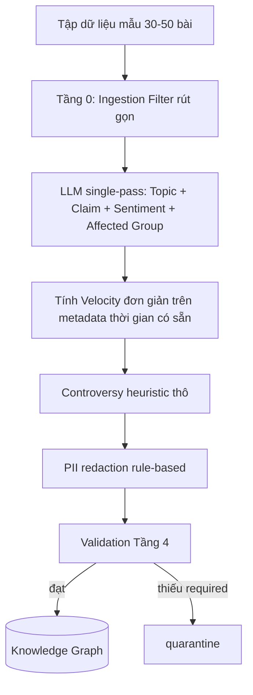

# NOXH Legal KG — Bộ lọc & Schema trường dữ liệu cho Public Discourse Agent
## Bản rút gọn cho Hackathon (còn 36 giờ)

| | |
|---|---|
| **Nguồn gốc** | Rút gọn từ bản đặc tả gốc (4 tầng lọc đầy đủ) do giới hạn thời gian |
| **Trạng thái** | MVP Scope v1.0 — build trong 36h còn lại |
| **Nguyên tắc rút gọn** | Giữ đủ 4 mục tiêu nghiệp vụ gốc, cắt bỏ phần cần hạ tầng dài hơi (crawler tự động, cron reclustering, agent xác minh có SLA) |

> Tài liệu gốc đúng hướng nhưng có khối lượng tương đương một hệ thống production (embedding reclustering mỗi 6h, LLM extraction nhiều bước, Claim Verification Agent riêng có SLA 2h, crawler đa nền tảng tuân thủ ToS). Với 36h, mục tiêu là chứng minh được **luồng giá trị cốt lõi chạy được đầu-cuối** trên một tập dữ liệu nhỏ, không phải một hệ thống realtime hoàn chỉnh.

---

## 1. Bảng cắt giảm phạm vi (What stays / What's cut)

| Tính năng | Bản gốc | Quyết định cho 36h | Lý do |
|---|---|---|---|
| Thu thập dữ liệu | Crawler tự động đa nền tảng (Facebook, diễn đàn) real-time | **Cắt → dùng tập dữ liệu mẫu đã tuyển chọn thủ công (~30–50 bài)** | Xây crawler tuân thủ ToS Facebook trong 36h là không khả thi và rủi ro pháp lý; tuyển thủ công vừa nhanh vừa né rủi ro ToS đã nêu ở review trước |
| Gom nhóm chủ đề | Taxonomy L1+L2+L3 tự do, cluster embedding + HDBSCAN/BERTopic, tái tính mỗi 6h | **Giữ L1+L2 cố định, bỏ L3 tự do và bỏ reclustering định kỳ** — phân loại 1 lần bằng LLM khi ingest | Reclustering định kỳ là hạ tầng vận hành (cron, theo dõi drift) — không cần thiết để chứng minh giá trị |
| Phát hiện claim tăng nhanh | `velocity_score` so với baseline trung bình 7 ngày, `acceleration` đạo hàm bậc 2 | **Giữ khái niệm, đơn giản hoá công thức** (mục 5) — không có 7 ngày dữ liệu lịch sử để tính baseline trong 36h | Baseline 7 ngày không tồn tại với dữ liệu mới thu thập; công thức phức tạp không kiểm chứng được trong demo |
| Sentiment | Sentiment + `emotion_tags` mở | **Giữ, thu hẹp `emotion_tags` xuống danh sách cố định nhỏ** | Đủ để minh hoạ, không cần mở rộng danh sách cảm xúc |
| Mức độ tranh cãi | `stance_distribution` tính trên toàn bộ comment (agree/disagree/neutral %) | **Cắt còn heuristic thô** (mục 6) — không phân loại từng comment | Cần pipeline scrape + phân loại comment riêng — quá lớn cho 36h |
| Nhóm bị ảnh hưởng | Danh sách mở, suy luận từ nhiều nguồn | **Giữ, rút xuống danh sách cố định 5 nhóm** | Đủ cho nhu cầu demo, dễ kiểm chứng bằng `group_evidence` |
| Claim Verification Agent + SLA 2h | Agent tự động xác minh, publish kết luận | **Cắt hoàn toàn khỏi scope 36h** — chỉ làm phần routing (gắn cờ `priority: P1`), KHÔNG tự động verify/publish | Đây là rủi ro AI Safety lớn nhất nếu làm vội trong 36h; để người xem demo hiểu "hệ thống phát hiện và gắn cờ", việc xác minh vẫn cần con người |
| Claim clustering ngữ nghĩa (gộp claim trùng ý khác chữ) | `claim_cluster_id` qua embedding | **Cắt** — chấp nhận hạn chế: claim diễn đạt khác nhau bị đếm riêng | Ghi rõ là known limitation, không chặn demo |
| OCR ảnh chụp văn bản | `media_ocr_text` | **Cắt** | Stretch goal nếu còn thời gian sau khi core chạy được, không phải P0 |
| PII redaction | NER-based, xử lý quasi-identifier trong văn phong | **Rút gọn: rule-based** (regex số điện thoại/email + hash một chiều tác giả) | Đủ tuân thủ NĐ 13/2023 ở mức tối thiểu bắt buộc; redaction sâu hơn để Phase 2 |

**Quyết định (Decision):** Scope 36h tập trung vào 4 mục tiêu gốc nhưng chạy trên dữ liệu tĩnh, xử lý theo batch một lần (không realtime, không cron), và không có bước tự động hoá xác minh/publish claim. Đây là lựa chọn đánh đổi bắt buộc để có một demo chạy được thay vì một thiết kế đẹp nhưng dang dở.

---

## 2. Pipeline rút gọn



So với bản gốc (4 tầng riêng biệt, nhiều lượt gọi LLM khác nhau), bản 36h **gộp Tầng 1–3 thành một lượt gọi LLM có structured output** để tiết kiệm thời gian dev và số lần gọi API, chấp nhận đánh đổi độ chính xác từng bước riêng lẻ.

---

## 3. Tầng 0 — Ingestion Filter (rút gọn)

### 3.1 Nguồn dữ liệu

| Trường | Kiểu | Bắt buộc | Enum/Quy tắc (đã chốt cho MVP) |
|---|---|---|---|
| `source_platform` | enum | ✅ | `facebook`, `forum`, `other` |
| `source_type` | enum | ✅ | `post`, `comment` |
| `source_url` | string | ✅ | URL công khai, không cần đăng nhập |
| `source_channel` | string | ✅ | Tên group/diễn đàn, lowercase |
| `source_visibility` | enum | ✅ | Chỉ nhận `public` |
| `source_trust_tier` | enum | ✅ | `official` (cơ quan/báo chí chính thống), `community` (còn lại) |
| `collection_method` | enum | ✅ **(mới thêm)** | `manual_curated` — MVP 36h chỉ dùng giá trị này; `official_api`/`automated_scrape` để trống cho Phase 2 |
| `crawled_at` | datetime | ✅ | ISO-8601, `Asia/Ho_Chi_Minh` |

> **Quyết định (mới so với bản gốc):** thêm trường `collection_method` để mọi record tự khai báo cách thu thập — phục vụ đúng câu hỏi rủi ro ToS đã nêu ở phần review. MVP chỉ có giá trị `manual_curated`.

### 3.2 Keyword Gate (giữ nguyên logic gốc, không đổi)

Lớp 1 (anchor) và Lớp 2 (loại trừ) giữ nguyên như bản gốc — đây là phần rule-based rẻ, không tốn thời gian dev thêm.

| Trường | Kiểu | Bắt buộc | Quy tắc |
|---|---|---|---|
| `matched_keywords` | string[] | ✅ | ≥ 1 từ khóa lớp 1 |
| `keyword_match_score` | float 0–1 | ✅ | Ngưỡng nhận ≥ 0.35 (giữ nguyên, chưa có dữ liệu để hiệu chỉnh lại trong 36h) |
| `exclusion_flags` | string[] | ➖ | `spam`, `ads`, `duplicate`, `off_topic` |
| `is_duplicate_of` | string | ➖ | So khớp đơn giản bằng simhash trên tập nhỏ, không cần hạ tầng riêng |

### 3.3 Content Quality Gate (rút gọn)

| Trường | Kiểu | Bắt buộc | Quy tắc |
|---|---|---|---|
| `content_raw` | string | ✅ | ≥ 15 ký tự có nghĩa |
| `content_clean` | string | ✅ | Bỏ emoji/hashtag rác, NFC normalize |
| `language` | enum | ✅ | `vi`, `other` (gộp `en`/`mixed` vào `other` cho đơn giản — dữ liệu demo gần như toàn tiếng Việt) |
| `published_at` | datetime | ✅ | Nếu không rõ → `time_confidence: low` |
| `time_confidence` | enum | ✅ | `exact`, `low` (bỏ mức `estimated` cho gọn) |

**Cắt khỏi MVP:** `has_media`, `media_ocr_text` — không xử lý ảnh trong 36h.

---

## 4. Topic + Claim (gộp 1 lượt LLM)

### 4.1 Taxonomy chủ đề — giữ nguyên L1, rút gọn L2 xuống 1 nhánh tiêu biểu/nhóm

| L1 | L2 giữ lại cho MVP |
|---|---|
| `DOI_TUONG` | `doi_tuong_thu_nhap`, `doi_tuong_cu_tru` |
| `HO_SO` | `ho_so_giay_to` |
| `TRINH_TU` | `trinh_tu_dang_ky`, `trinh_tu_boc_tham` |
| `TAI_CHINH` | `gia_ban_gia_thue`, `vay_uu_dai` |
| `GIAO_DICH` | `chuyen_nhuong_thoi_han` |
| `DU_AN` | `du_an_tien_do`, `du_an_phap_ly` |
| `VAN_BAN` | `van_ban_moi_hieu_luc` |
| `TIEU_CUC` | `ke_khai_sai`, `lua_dao` — **bắt buộc `needs_review` thủ công, không tự động hoá dù confidence cao** (rủi ro vu khống đã nêu ở review) |

Các nhánh L2 khác trong bản gốc không xoá khỏi thiết kế lâu dài — chỉ tạm không dùng cho demo 36h vì tập dữ liệu mẫu nhỏ khó có đủ ví dụ mỗi nhánh.

| Trường | Kiểu | Bắt buộc | Quy tắc |
|---|---|---|---|
| `topic_l1` | enum | ✅ | Theo bảng trên |
| `topic_l2` | enum | ✅ | Phải thuộc đúng nhánh `topic_l1` |
| `topic_confidence` | float 0–1 | ✅ | < 0.6 → `needs_review` |
| `locality_mentioned` | string[] | ➖ | Chuẩn hoá theo mã tỉnh/thành nếu nhắc tới |
| `project_mentioned` | string[] | ➖ | Map về `HousingProject` — **dùng chung node với `Project` trong Project Knowledge DB** đã thiết kế ở tài liệu Project Intelligence, không tạo node trùng |
| `legal_doc_mentioned` | string[] | ➖ | Giữ nguyên kể cả nhắc sai số hiệu |

**Cắt khỏi MVP:** `topic_l3_free`, `cluster_id`, `cluster_centroid_text` — không cần cluster embedding riêng khi tập dữ liệu chỉ 30–50 bài; nhóm theo `topic_l1/l2` là đủ để demo tính năng (1).

### 4.2 Claim

| Trường | Kiểu | Bắt buộc | Quy tắc |
|---|---|---|---|
| `claim_id` | string | ✅ | Hash của `claim_normalized` (chấp nhận known limitation: claim diễn đạt khác chữ bị tách — xem mục 1) |
| `claim_text_raw` | string | ✅ | Trích nguyên văn |
| `claim_normalized` | string | ✅ | [Chủ thể] + [được/phải/bị cấm] + [hành vi] + [điều kiện] + [thời điểm] |
| `claim_type` | enum | ✅ | `eligibility`, `procedure`, `financial`, `other` |
| `claim_polarity` | enum | ✅ | `assertion`, `question`, `warning` |
| `claim_subject` | string | ✅ | Free text, map thủ công về `ApplicantType` sau nếu cần |
| `claim_omits_conditions` | boolean | ✅ | Giữ nguyên — đây là tín hiệu giá trị nhất của cả thiết kế |
| `claim_absolute_language` | boolean | ✅ | Giữ nguyên |
| `extraction_confidence` | float 0–1 | ✅ | < 0.7 → `needs_review` |

**Cắt khỏi MVP:** `claim_conditions` (danh sách điều kiện chi tiết) — gộp thông tin này vào `claim_normalized` cho gọn.

---

## 5. Velocity — công thức đơn giản hoá

Không dùng baseline trung bình 7 ngày (không có dữ liệu lịch sử). Thay bằng so sánh 2 cửa sổ liền kề trên chính tập dữ liệu đã thu thập:

| Trường | Kiểu | Bắt buộc | Công thức |
|---|---|---|---|
| `mention_count_6h` | int | ✅ | Đếm bài/comment chứa cùng `claim_id` trong 6h gần nhất (theo `published_at`) |
| `mention_count_prev_6h` | int | ✅ | Đếm trong 6h liền trước đó |
| `growth_ratio` | float | ✅ | `mention_count_6h / max(mention_count_prev_6h, 1)` |
| `spread_breadth` | int | ✅ | Số `source_channel` khác nhau chứa claim — giữ nguyên, vẫn là cách rẻ nhất chống seeding |
| `trend_status` | enum | ✅ | `dormant` (mention_count_6h < 3), `rising` (≥3 và growth_ratio 1.5–3), `surging` (≥3 và growth_ratio > 3) |

**Cắt khỏi MVP:** `mention_count_1h/24h/7d`, `engagement_sum_24h` (cần trọng số like/share/comment — dữ liệu mẫu thủ công khó có số liệu engagement đầy đủ), `acceleration`, `velocity_score` chuẩn hoá theo baseline dài hạn.

> **Rule cảnh báo rút gọn:** `trend_status = surging` **VÀ** (`claim_absolute_language` **HOẶC** `claim_omits_conditions`) → gắn `priority: P1` trong output. Demo chỉ cần **hiển thị cờ này trên dashboard**, không cần route tự động sang agent xác minh (đã cắt ở mục 1).

---

## 6. Sentiment & Controversy (rút gọn)

### 6.1 Sentiment

| Trường | Kiểu | Bắt buộc | Enum (chốt MVP) |
|---|---|---|---|
| `sentiment_target` | enum | ✅ | `policy`, `project`, `developer` |
| `sentiment_label` | enum | ✅ | `positive`, `negative`, `neutral` |
| `emotion_tags` | string[] | ➖ | `lo_lang`, `buc_xuc`, `hy_vong` (rút từ 5 xuống 3 nhãn phổ biến nhất) |

**Cắt khỏi MVP:** `sentiment_intensity` (float cường độ) — nhãn rời rạc là đủ để demo, tránh phải hiệu chỉnh ngưỡng cường độ không có dữ liệu kiểm định.

### 6.2 Controversy — heuristic thô thay vì phân tích từng comment

| Trường | Kiểu | Bắt buộc | Quy tắc |
|---|---|---|---|
| `controversy_level` | enum | ✅ | Suy từ **số lượng bài phản bác trong cùng `claim_id`** (không phân loại từng comment): `low` nếu tất cả bài cùng chiều sentiment, `medium` nếu có 1–2 bài trái chiều, `high` nếu ≥ 3 bài trái chiều xuất hiện trong cùng cửa sổ 6h |
| `conflict_type` | enum | ➖ | `hieu_nham_phap_ly` (ưu tiên xử lý), `khac` |

**Cắt khỏi MVP:** `stance_distribution` (%), công thức `controversy_score` liên tục — heuristic bậc thang (low/medium/high) đủ để demo tính năng (3) mà không cần crawl/phân loại comment riêng.

### 6.3 Affected Group (rút gọn danh sách)

| Trường | Kiểu | Bắt buộc | Enum (chốt MVP — 5 nhóm) |
|---|---|---|---|
| `affected_group` | enum[] | ✅ | `nguoi_mua_lan_dau`, `ho_thu_nhap_thap_do_thi`, `cong_nhan`, `nguoi_dang_thue`, `khac` |
| `group_evidence` | string | ✅ | Trích đoạn làm căn cứ — bắt buộc, không đổi so với bản gốc |

---

## 7. PII Redaction (rút gọn còn rule-based)

| Bước | Cách làm trong 36h |
|---|---|
| Ẩn danh tác giả | `author_id_hash` = SHA-256(author_id gốc + salt cố định), chỉ giữ `author_type` (`ca_nhan`/`page`) |
| Xoá số điện thoại/email | Regex loại bỏ trước khi lưu `content_clean` |
| Xoá tên thật trong nội dung | **Không xử lý NER trong 36h** — nếu `content_raw` chứa tên riêng của bên thứ ba, gắn cờ `needs_review` thay vì tự động xoá (an toàn hơn là tự động xoá sai) |

> **Risk còn lại sau rút gọn:** redaction rule-based không bắt được hết quasi-identifier trong văn phong. Chấp nhận rủi ro thấp cho demo nội bộ (không public dữ liệu ra ngoài), phải nâng cấp lên NER-based trước khi đưa ra ngoài phạm vi demo.

---

## 8. Tầng 4 — Chuẩn đầu ra & Validation (giữ nguyên tinh thần gốc)

Điều kiện ghi vào graph không đổi:

- Đủ trường required của mục 3–6
- `topic_confidence ≥ 0.6` và `extraction_confidence ≥ 0.7`
- Đã qua bước redaction ở mục 7
- `is_duplicate_of` rỗng

Mapping node/edge sang Knowledge Graph **giữ nguyên như bản gốc** (không cắt — đây là phần rẻ, chỉ là mapping dữ liệu, không phải hạ tầng mới):

| Dữ liệu | Node/Edge |
|---|---|
| Record bài đăng | `SocialPost` |
| `claim_normalized` | `PublicClaim` + edge `POST_CONTAINS_CLAIM` |
| `topic_l1/l2` | `LegalTopic` + edge `CLAIM_REFERENCES_TOPIC` |
| `legal_doc_mentioned` | edge `CLAIM_CITES_DOCUMENT` (`citation_valid: false` nếu trích sai) |
| `project_mentioned` | edge tới `HousingProject` (= node `Project` dùng chung với Project Intelligence) |
| `trend_status`, `controversy_level` | thuộc tính của `PublicClaim` |

---

## 9. JSON schema mẫu (rút gọn)

```json
{
  "post": {
    "id": "fb_9f3a",
    "source_platform": "facebook",
    "source_type": "post",
    "source_channel": "hoi nha o xa hoi ha noi",
    "source_trust_tier": "community",
    "source_visibility": "public",
    "collection_method": "manual_curated",
    "published_at": "2026-07-17T09:12:00+07:00",
    "language": "vi",
    "content_clean": "Tu 1/7 cu thu nhap duoi 15 trieu la chac chan duoc mua NOXH nhe moi nguoi",
    "matched_keywords": ["NOXH", "thu nhap", "1/7"],
    "keyword_match_score": 0.82,
    "topic_l1": "DOI_TUONG",
    "topic_l2": "doi_tuong_thu_nhap",
    "topic_confidence": 0.93,
    "author_id_hash": "a41c...",
    "author_type": "ca_nhan"
  },
  "claims": [
    {
      "claim_id": "clm_7d21",
      "claim_text_raw": "cu thu nhap duoi 15 trieu la chac chan duoc mua NOXH",
      "claim_normalized": "Ca nhan thu nhap duoi 15 trieu/thang duoc mua NOXH, khong kem dieu kien khac, tu 01/07/2026",
      "claim_type": "eligibility",
      "claim_polarity": "assertion",
      "claim_subject": "ca_nhan_thu_nhap_thap",
      "claim_omits_conditions": true,
      "claim_absolute_language": true,
      "extraction_confidence": 0.91,
      "velocity": {
        "mention_count_6h": 8,
        "mention_count_prev_6h": 2,
        "growth_ratio": 4.0,
        "spread_breadth": 4,
        "trend_status": "surging"
      },
      "sentiment": {
        "sentiment_target": "policy",
        "sentiment_label": "positive",
        "emotion_tags": ["hy_vong"]
      },
      "controversy": {
        "controversy_level": "medium",
        "conflict_type": "hieu_nham_phap_ly"
      },
      "affected_group": ["nguoi_mua_lan_dau"],
      "group_evidence": "'moi nguoi' + ngu canh hoi mua lan dau trong group nguoi mua",
      "priority": "P1"
    }
  ]
}
```

---

## 10. Phân bổ thời gian 36h (đề xuất)

| Khung giờ | Việc chính | Ghi chú |
|---|---|---|
| 0–4h | Tuyển thủ công 30–50 bài mẫu (đa dạng topic/độ tranh cãi), dựng schema DB rút gọn | Ưu tiên có ít nhất 2–3 claim có `trend_status: surging` trong dữ liệu mẫu để demo rõ tính năng (2) |
| 4–12h | Ingestion Filter rule-based (mục 3) + prompt LLM single-pass (mục 4) | Test prompt trên 5–10 bài đầu trước khi chạy hết tập |
| 12–18h | Velocity đơn giản (mục 5) + Sentiment/Controversy heuristic (mục 6) | Thuần logic tính toán trên dữ liệu đã có, không cần gọi thêm LLM |
| 18–24h | Redaction rule-based (mục 7) + Validation + ghi vào KG (mục 8) | Kết nối với Knowledge Graph đã thiết kế ở tài liệu Project Intelligence |
| 24–30h | Dashboard/demo hiển thị: danh sách claim theo `trend_status`, cờ `priority: P1` | Không cần xây UI phức tạp — bảng + filter là đủ |
| 30–34h | Test toàn luồng, sửa lỗi, chuẩn bị 2–3 kịch bản demo | Kịch bản nên có: 1 claim surging bị flag đúng, 1 claim bị loại đúng ở Keyword Gate |
| 34–36h | Buffer, tập dượt trình bày | Không code thêm tính năng mới trong khung này |

---

## 11. Risk còn lại sau khi rút gọn

| # | Risk | Mức độ | Ghi chú |
|---|---|---|---|
| 1 | Dữ liệu mẫu thủ công không đủ đa dạng để claim "surging" trông thuyết phục | Trung bình | Chủ động chọn dữ liệu có ít nhất vài claim lặp lại ở nhiều kênh khác nhau (xem mục 10, khung 0–4h) |
| 2 | Claim diễn đạt khác chữ bị đếm tách rời (đã cắt claim clustering) | Trung bình | Chấp nhận cho demo; nêu rõ đây là limitation khi trình bày, không che giấu |
| 3 | `TIEU_CUC` gán nhãn sai gây rủi ro vu khống nếu vô tình tự động hoá | Cao nếu không tuân thủ | Bắt buộc giữ rule "needs_review thủ công" cho nhánh này dù áp lực thời gian |
| 4 | PII redaction rule-based bỏ sót quasi-identifier | Thấp (demo nội bộ) | Không dùng dữ liệu này cho mục đích ngoài demo trước khi nâng cấp NER |
| 5 | Không có Claim Verification Agent thật — demo chỉ dừng ở "phát hiện + gắn cờ" | Thấp nếu trình bày rõ ràng | Nói rõ với người xem đây là ranh giới scope 36h, không giả vờ đã có verify tự động |

---

## 12. Việc dời sang Phase 2 (không mất, chỉ hoãn)

- Crawler tự động tuân thủ ToS (chính thức hoá qua official API nếu nền tảng cho phép) thay cho dữ liệu tuyển thủ công
- Claim clustering theo embedding để gộp claim trùng ý khác chữ
- Velocity chuẩn theo baseline lịch sử dài hạn (`velocity_score`, `acceleration`)
- Controversy score liên tục dựa trên phân loại từng comment (`stance_distribution`)
- Claim Verification Agent tự động với SLA, có con người duyệt trước khi publish kết luận
- OCR ảnh chụp văn bản/công văn
- PII redaction NER-based, xử lý quasi-identifier trong văn phong
- Taxonomy L2 đầy đủ + L3 tự do qua reclustering định kỳ

## 13. Khuyến nghị

Chấp nhận bản rút gọn này làm scope chính thức cho 36h còn lại. Toàn bộ phần bị cắt đều được ghi lại rõ ràng ở mục 12 để không bị hiểu nhầm là "quên" khi nhìn lại thiết kế gốc sau hackathon — đây là đánh đổi có chủ đích, không phải thiếu sót. Ưu tiên cao nhất trong 36h là làm cho luồng **Keyword Gate → LLM extraction → Velocity đơn giản → gắn cờ P1 → hiển thị dashboard** chạy được đầu-cuối trên dữ liệu thật (dù nhỏ), thay vì cố làm đẹp từng công thức riêng lẻ mà không kịp nối hết pipeline.
