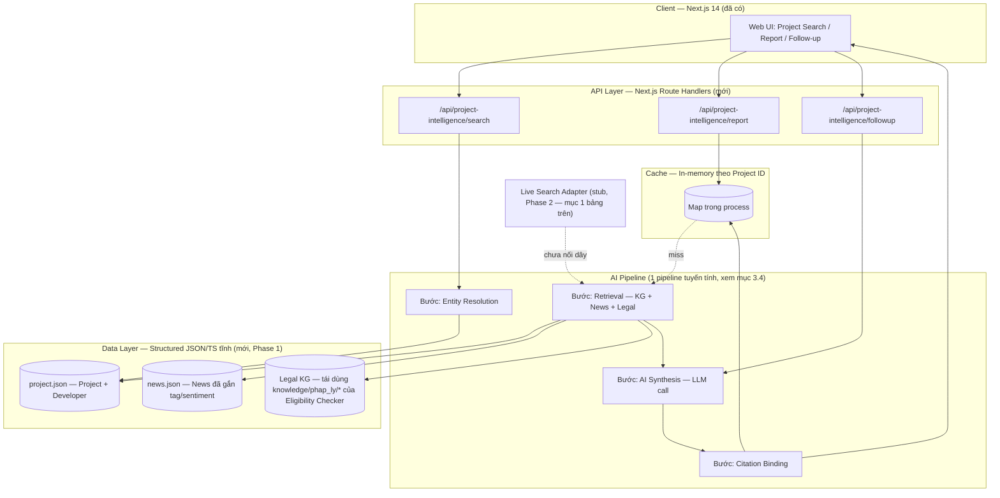
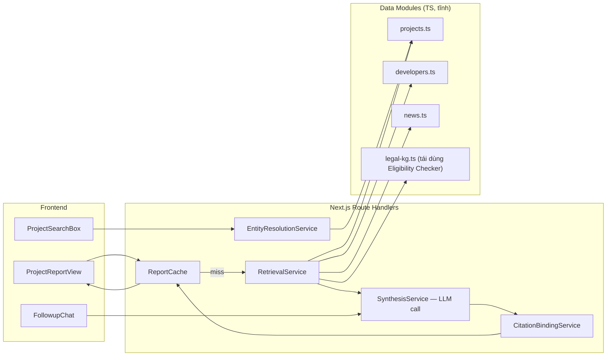
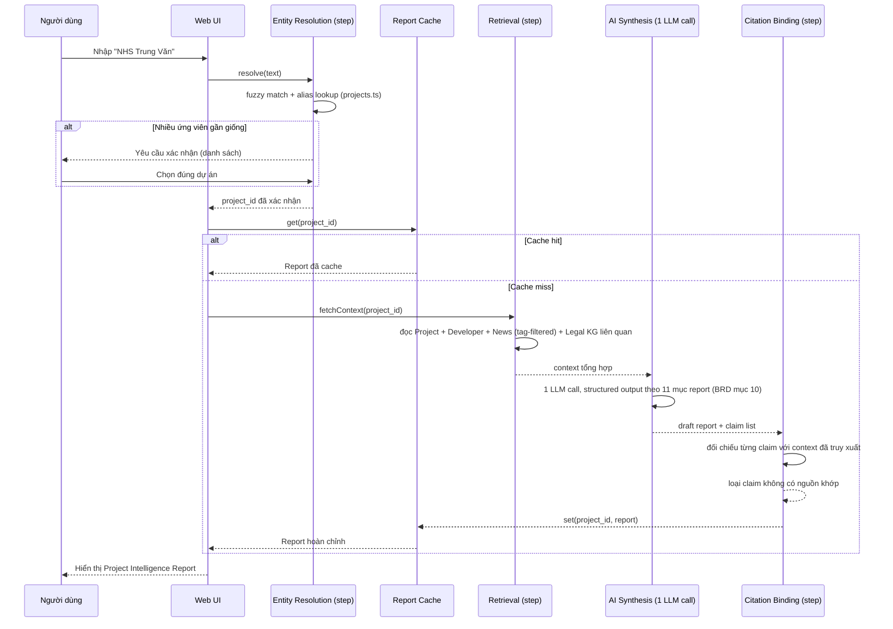
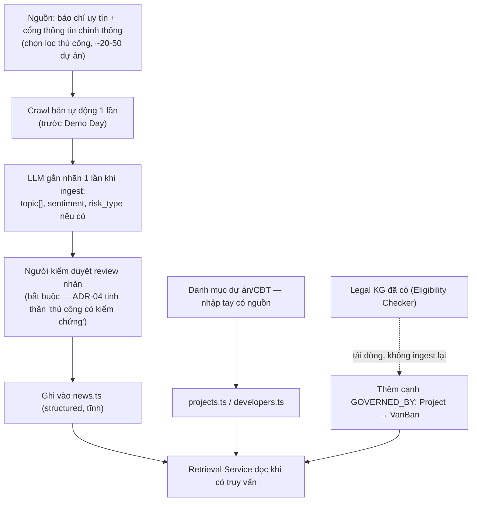
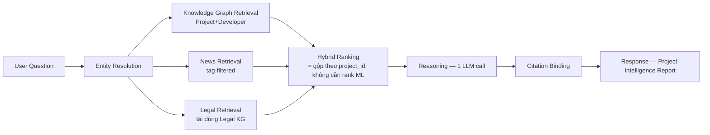
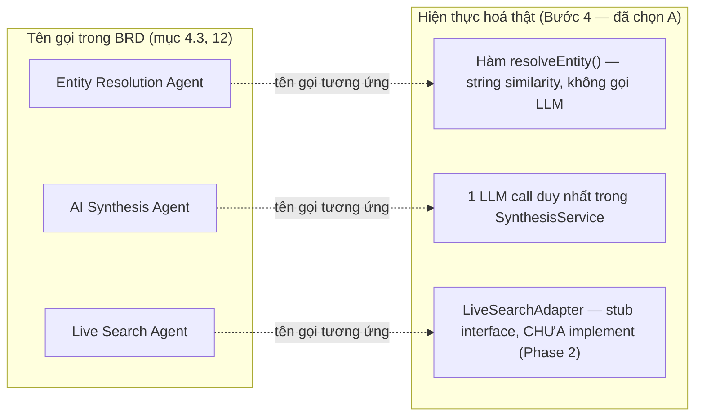
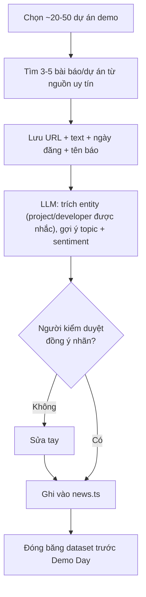
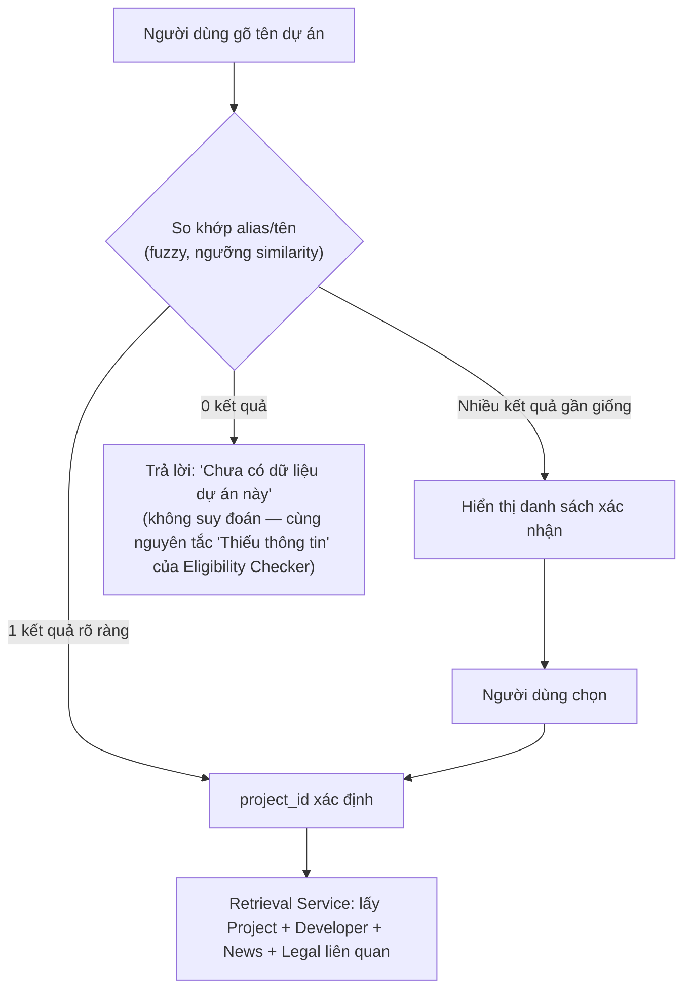

# 03 — Final Architecture

> Đọc trong 15 phút. Bước 4 (chọn phương án cuối) + Bước 5 (Technical Architecture, Mermaid). Mỗi lựa chọn tham chiếu ngược bảng so sánh ở `02_SOLUTION_OPTIONS.md` Phần B.

## 1. Bảng quyết định cuối cùng

| Thành phần | Phương án chọn | Vì sao chọn | Vì sao không chọn phương án khác | Trade-off chấp nhận |
|---|---|---|---|---|
| Entity Resolution | **B — Fuzzy string match + alias list tĩnh** | Cân bằng giữa nhu cầu demo thật (xử lý tên mơ hồ kiểu "Ecohome") và rủi ro hạ tầng; không cần ML | A (exact match) thất bại ngay chính kịch bản BRD dùng làm ví dụ khác biệt; C (embedding) là hạ tầng mới không cần thiết ở N=20-50 | Có thể nhầm một số tên gần giống về mặt chữ nhưng khác dự án — chấp nhận được ở tập dữ liệu demo đã kiểm soát |
| News Crawl | **A — Crawl thủ công/bán tự động 1 lần, đóng băng dataset trước Demo Day** | Loại bỏ hoàn toàn rủi ro "Crawler Failure" đúng lúc trình bày; kiểm soát chất lượng dữ liệu | B (crawler tự động) tốn thời gian xây + rủi ro lỗi ngay trước demo; C (chỉ Live Search) không xây được News DB bền vững | Dữ liệu tin tức không tự cập nhật sau khi đóng băng — chấp nhận được, minh bạch bằng timestamp "crawled_at" hiển thị rõ trong report |
| Knowledge Graph — lưu trữ | **C — Structured JSON/TS tĩnh (không DB mới)**, đi ngược đề xuất mặc định "PostgreSQL + pgvector" của BRD gốc mục 12.1 | Repo hiện có **0% backend, 0 DB driver nào từng chạy**. Đưa Postgres vào giữa 48h là điểm rủi ro hạ tầng cao nhất trong toàn bộ so sánh B3. Ở quy mô ~20-50 dự án + vài trăm tin tức, JSON/TS tĩnh (đúng pattern đã dùng cho `knowledge/phap_ly/*.md`, `web/mock/*.ts`) đáp ứng 100% chức năng demo-visible (search, lookup quan hệ qua tham chiếu object, "graph" 1-2 hop bằng join JS thuần) | A (Postgres) đúng hướng production nhưng là "thứ chưa ai trong đội từng chạy" — vi phạm trực tiếp nguyên tắc chọn công nghệ đã thống nhất ở `13_QUYET_DINH_KIEN_TRUC.md` ("đội đã quen thuộc để tối ưu tốc độ build"); B (Neo4j) bị loại ngay từ vòng so sánh B3, rủi ro cao nhất | Mất khả năng truy vấn đa hop thật và ghi đồng thời an toàn — không cần thiết cho 1 phiên demo đọc-là-chính. Migrate sang Postgres là **Phase 2 tường minh** (mục 4 bên dưới), không phải bị lãng quên |
| Vector Search / Embedding | **C — Keyword/tag filter thuần** (không pgvector, không embedding runtime) | Vì đã chọn C ở Knowledge Graph, pgvector không khả dụng; News đã được gắn `topic[]`/`sentiment` lúc ingest (LLM 1 lần, xem Data Pipeline), nên truy xuất chỉ cần lọc theo `project_id` + tag — đủ recall ở tập dữ liệu đã curate kỹ | A (pgvector) phụ thuộc B3-A đã bị loại; B (in-process embedding) là nâng cấp rẻ, **giữ làm tuỳ chọn nếu còn thời gian dư** (xem `10_TECHNICAL_DECISION.md`), không phải yêu cầu bắt buộc | Không xử lý được câu hỏi diễn đạt hoàn toàn khác từ ngữ so với tag đã gắn — chấp nhận được vì UI hiện có (Eligibility Workspace) đã dùng câu hỏi có cấu trúc, không phải free-text tìm kiếm mở |
| Live Search | **B — Không triển khai ở MVP**, hiển thị "Dữ liệu tính đến ngày X" | Loại bỏ rủi ro chi phí/rate-limit/API lỗi ngay lúc demo trực tiếp trước giám khảo — đúng nguyên tắc "ổn định trước, mở rộng sau" | A (Live Search thật) đúng tinh thần Hybrid của BRD nhưng thêm dependency ngoài không kiểm soát được trong 1 buổi demo | Mất trải nghiệm "luôn mới nhất" — kiến trúc vẫn thiết kế sẵn 1 interface rỗng (`LiveSearchAdapter`, xem mục 3.5) để nối dây ở Phase 2 mà không phải sửa pipeline |
| Caching | **B — In-memory cache theo Project ID trong process Next.js** | Rẻ, nhanh implement, cải thiện rõ rệt trải nghiệm khi giám khảo hỏi lại cùng dự án — không thêm hạ tầng | A (không cache) chậm/tốn token khi lặp câu hỏi; C (Redis) dư thừa cho 1 server demo | Mất cache khi restart server — chấp nhận được, demo chạy trong 1 phiên liên tục |
| Reasoning (AI Synthesis) | **A — 1 pipeline tuyến tính nhiều bước**, mỗi "Agent" tên trong BRD (Entity Resolution, AI Synthesis, Live Search) là **1 hàm/bước có tên rõ ràng trong cùng pipeline**, không phải service độc lập | Tái dùng nguyên ADR-03 đã được xác nhận cho Eligibility Checker; tái dùng UI `reasoningSteps` đã build sẵn (`web/hooks/use-eligibility-chat.ts`); dễ debug trong thời gian ngắn | B (agentic loop tự lặp) khó kiểm soát thời lượng/chi phí; C (multi-agent độc lập thật) là đúng loại rủi ro "Potemkin AI" mà `docs/16_DESIGN_REVIEW.md` đã cảnh báo cụ thể ("giám khảo hỏi cho xem 4 agent chạy độc lập ở đâu") | Kém linh hoạt hơn khi cần agent tự quyết định có tra thêm nguồn hay không — chấp nhận được, phạm vi demo không cần mức tự chủ đó |
| Citation Binding | **A — Post-processing bắt buộc**, reject claim không có nguồn khớp | Không thương lượng theo chính BRD; đồng nhất ADR-01 đã áp dụng cho Eligibility Checker | B (chỉ prompt instruction) lặp lại đúng điểm yếu Design Review đã chỉ ra ("dùng AI kiểm tra AI") | Thêm 1 bước xử lý structured-output parsing — chi phí kỹ thuật thấp so với rủi ro tránh được |

**Nguyên tắc xuyên suốt bảng trên**: mọi lựa chọn "giản lược" đều đi kèm một đường nâng cấp tường minh (không phải cắt bỏ vĩnh viễn) — đúng yêu cầu "có khả năng mở rộng" trong Mục tiêu Technical Discovery.

---

## 2. Overall Architecture

## 3. Component Diagram

## 4. Sequence Diagram — Project Intelligence Flow (đầu-cuối)

## 5. Data Flow (Ingestion → Serving)

## 6. AI Pipeline (chi tiết ở `05_AI_PIPELINE.md`)

## 7. Agent Flow — mapping tên "Agent" trong BRD sang bước pipeline thật

> **Ghi chú minh bạch (phục vụ Bước 12 / trả lời giám khảo)**: chỉ có **đúng 1 lệnh gọi LLM thật** trong toàn bộ pipeline (bước Reasoning/AI Synthesis). Entity Resolution là thuật toán string-matching, không phải "agent" theo nghĩa autonomous. Đây là lựa chọn có chủ đích (xem hàng "Reasoning" ở mục 1), không phải rút gọn ngoài ý muốn — nói thẳng điều này với giám khảo tốt hơn để họ tự phát hiện.

## 8. Crawler Flow (thủ công/bán tự động, 1 lần)

## 9. Query Flow (Search → Entity Resolution → Retrieval)

## 10. Ràng buộc kiến trúc mang từ Discovery

- Không cho AI Synthesis tự suy luận pháp lý ngoài phạm vi Legal KG đã truy xuất (kế thừa ADR-01, áp dụng chéo 2 module).
- Retrieval Service chỉ đọc (read-only) dữ liệu tĩnh — không có ghi/cập nhật runtime ở MVP, đúng tinh thần ADR-04 (thủ công có kiểm chứng) áp dụng sang News/Project data.
- Toàn bộ kiến trúc trên giả định LLM provider sẽ được chọn theo OPEN QUESTION đang treo (`01_TECHNICAL_DISCOVERY.md` mục cuối) — thiết kế **không khoá cứng vào 1 provider cụ thể** (SynthesisService gọi qua 1 interface trừu tượng duy nhất).
