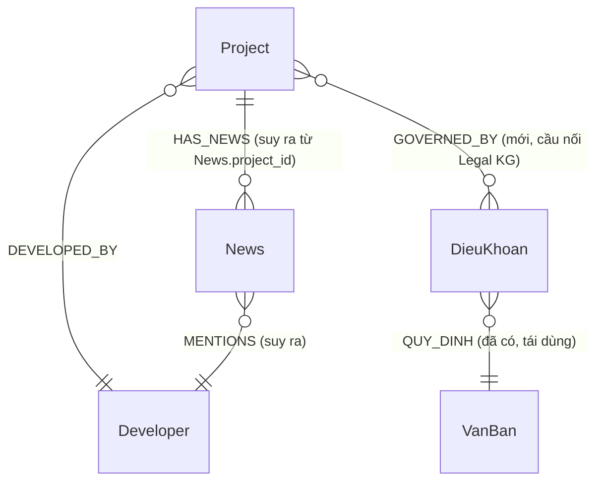

# 04 — Data Model

> Đọc trong 10 phút. Bước 6. Mở rộng từ ontology hiện có (`knowledge/ontology/*.md`, viết cho Legal KG) sang Project Knowledge Graph. Áp dụng quyết định lưu trữ đã chốt ở `03_FINAL_ARCHITECTURE.md` §1: **Structured JSON/TS tĩnh, không DB** — "Index" ở tài liệu này nghĩa là *lookup map trong bộ nhớ ứng dụng*, không phải SQL index.

## 1. Phạm vi node — rút gọn theo MoSCoW (`02_SOLUTION_OPTIONS.md` Phần A)

BRD gốc (`docs/features/PROJECT_INTELLIGENCE.md` mục 8.1) đề xuất 10 loại node. Bảng dưới đây chốt phạm vi MVP:

| Node (BRD) | Trong MVP? | Lý do |
|---|---|---|
| Project | Có — Must Have | Trung tâm của toàn bộ module |
| Developer | Có — rút gọn | Chỉ hồ sơ tĩnh, bỏ liên kết rủi ro chéo dự án (Phase 2) |
| News | Có — Must Have | FR-05, giá trị demo cao nhất |
| LegalDocument | **Tái dùng `VanBan`/`DieuKhoan` của Legal KG**, không tạo node mới | Tránh 2 nguồn sự thật pháp lý song song — vi phạm nguyên tắc "một nội dung, một nơi lưu" (`docs/12_QUAN_LY_RUI_RO.md`) |
| Province / District | Không — MVP | FR-02 rút gọn bỏ filter địa phương; `address` là field text tự do trên Project, không phải node/quan hệ riêng |
| Topic | Không — là field, không phải node | Ở mô hình JSON tĩnh không cần node riêng cho việc lọc tag; `topic: string[]` là thuộc tính trực tiếp trên News |
| Risk | Không — là field, không phải node | FR-07 rút gọn thành gắn nhãn thủ công lúc ingest; `risk_type`, `risk_severity` là thuộc tính trên News, không phải node độc lập có thể truy vấn chéo dự án (đó là năng lực Phase 2) |
| Policy | Không — Phase 2 | Không có FR nào ở MVP cần "chính sách" tách khỏi `VanBan` đã có |
| Person / Organization | Không — Phase 2 | Không FR nào MVP cần đại diện pháp luật/tổ chức bảo lãnh |

**Nguyên tắc**: giữ đúng khung khái niệm BRD (không đổi tên miền), chỉ hoãn thực thi hoá những node không có FR nào ở MoSCoW "Must/Should" cần đến.

## 2. Thiết kế Node (MVP)

### 2.1 Project
| Thuộc tính | Kiểu | Bắt buộc | Ghi chú |
|---|---|---|---|
| `project_id` | string (slug) | Có | VD: `nhs-trung-van` — sinh từ tên, dùng làm khoá lookup map |
| `name` | string | Có | Tên chính thức |
| `aliases` | string[] | Có | Phục vụ Entity Resolution (fuzzy match), xem mục 4 |
| `address` | string | Có | Text tự do, MVP không tách Province/District |
| `developer_id` | ref(Developer) | Có | |
| `legal_status` | enum(đã duyệt, đang chờ, vướng mắc) | Có | Hiển thị mục "Pháp lý" trong report |
| `construction_status` | string | Không | Mô tả ngắn tiến độ |
| `scale` | string | Không | VD: "500 căn" |
| `launch_time` | date | Không | |
| `source` | url | Có | Nguồn dữ liệu gốc — bắt buộc cho Citation |
| `data_verified_at` | date | Có | Ngày kiểm chứng dữ liệu — tương đương `do_tin_cay`/ngày tra cứu ở Legal KG |

### 2.2 Developer
| Thuộc tính | Kiểu | Bắt buộc | Ghi chú |
|---|---|---|---|
| `developer_id` | string (slug) | Có | |
| `legal_name` | string | Có | |
| `tax_code` | string | Không | Nếu có nguồn xác minh |
| `project_ids` | string[] | Có | Danh sách Project đã triển khai (kể cả không trong tập demo, nếu biết) |
| `note` | text | Không | Ghi chú uy tín/rủi ro dạng tóm tắt tay — **thay thế** cho cơ chế "phát hiện rủi ro chéo dự án" tự động (Phase 2) |
| `source` | url | Có | |

### 2.3 News
| Thuộc tính | Kiểu | Bắt buộc | Ghi chú |
|---|---|---|---|
| `news_id` | string | Có | Hash ngắn của URL, ổn định qua các lần build lại |
| `project_id` | ref(Project) | Có | Bắt buộc — không có News "mồ côi" không gắn dự án nào (tương đương nguyên tắc "không node mồ côi" ở `knowledge/ontology/node_types.md`) |
| `title` | string | Có | |
| `url` | url | Có | Bắt buộc cho Citation |
| `published_date` | date | Có | |
| `source_name` | string | Có | Tên tòa soạn |
| `source_tier` | enum(chính thống, báo chí, cộng đồng) | Có | Phục vụ AI Safety §11 BRD — phân tầng nguồn bắt buộc |
| `sentiment` | enum(tích cực, tiêu cực, trung lập) | Có | Gắn khi ingest (LLM 1 lần + người duyệt) |
| `topic` | string[] | Có | VD: `["tiến độ", "pháp lý"]` |
| `risk_type` | string \| null | Không | VD: "chậm tiến độ" — chỉ điền nếu tin tức là bằng chứng rủi ro (thay cho node Risk) |
| `crawled_at` | date | Có | Bắt buộc — hiển thị "dữ liệu tính đến ngày X" (thay Live Search ở MVP, xem `03_FINAL_ARCHITECTURE.md`) |

### 2.4 LegalDocument (tái dùng — không tạo mới)
Dùng nguyên `VanBan`/`DieuKhoan` đã định nghĩa ở `knowledge/ontology/node_types.md`. Không lặp lại thuộc tính ở đây (nguyên tắc Single Source of Truth, `docs/12_QUAN_LY_RUI_RO.md`).

## 3. Thiết kế Relationship (MVP)

| Quan hệ | Từ → Đến | Cách hiện thực trong JSON tĩnh | Bắt buộc |
|---|---|---|---|
| `DEVELOPED_BY` | Project → Developer | `Project.developer_id` (tham chiếu trực tiếp) | Có |
| `HAS_NEWS` | Project → News | Suy ra ngược từ `News.project_id` (không lưu 2 chiều để tránh lệch dữ liệu) | Có |
| `MENTIONS` | News → Developer | Suy ra: nếu `News.project_id` → `Project.developer_id` trùng Developer đang xét | Có (suy ra, không lưu tường minh) |
| `GOVERNED_BY` | Project → VanBan/DieuKhoan (Legal KG) | **Quan hệ mới, cầu nối 2 module** — `Project.applicable_legal_doc_ids: string[]`, trỏ sang `ma_hieu` của `VanBan` trong Legal KG | Có — đây là điểm tích hợp trực tiếp với Eligibility Checker |
| `HAS_RISK_HISTORY` | Developer → Risk | **Không triển khai MVP** — thay bằng `Developer.note` (text tay) | Phase 2 |
| `INDICATES_RISK` / `AFFECTS` | News → Risk → Project | **Không triển khai MVP** — thay bằng `News.risk_type` trực tiếp trên News | Phase 2 |
| `LOCATED_IN`, `APPLIES_TO` (Province/District) | — | **Không triển khai MVP** | Phase 2 |

> **Quy tắc nhất quán khi thêm `GOVERNED_BY`** (áp dụng nguyên tắc đã có ở `knowledge/ontology/relationship_types.md` cho `SUA_DOI_BOI_SUNG`): trước khi gắn `Project.applicable_legal_doc_ids`, phải kiểm tra `trang_thai_hieu_luc` của `DieuKhoan` đích — chỉ trỏ tới điều khoản **đang hiệu lực**, không trỏ tới điều khoản đã bị thay thế. Đây là điểm rủi ro chồng lấp y hệt rủi ro đã ghi ở `docs/07_KNOWLEDGE_GRAPH.md` (NĐ 54/2026 vs NĐ 136/2026), áp dụng chéo sang module mới.

## 4. Metadata bắt buộc trên mọi node (kế thừa nguyên tắc Legal KG)

Áp dụng nguyên văn nguyên tắc ở `knowledge/ontology/node_types.md` mục cuối: *"Mọi node đều phải truy vết được về nguồn gốc — không có node mồ côi"*. Với Project KG:

| Trường metadata | Bắt buộc trên | Ý nghĩa |
|---|---|---|
| `source` (url) | Project, Developer, News | Bắt buộc cho Citation (FR-09) |
| `data_verified_at` / `crawled_at` | Project/Developer, News | Tương đương `do_tin_cay`/ngày tra cứu — cho phép hiển thị "dữ liệu tính đến ngày X" |
| `source_tier` | News | Phân tầng nguồn bắt buộc theo AI Safety §11 BRD |

## 5. Index / Lookup Map (thay cho SQL Index vì đã chọn lưu trữ tĩnh)

| Lookup cần có | Cấu trúc trong bộ nhớ | Dùng cho |
|---|---|---|
| `aliasIndex: Map<normalizedAlias, project_id>` | Dựng 1 lần lúc khởi động server từ `Project.aliases` + `Project.name` | Entity Resolution (fuzzy match chạy trên tập khoá của map này) |
| `newsByProject: Map<project_id, News[]>` | Dựng 1 lần từ `news.ts`, group theo `project_id` | Retrieval Service — tránh quét toàn bộ mảng News mỗi request |
| `newsByProjectAndTopic: Map<"${project_id}:${topic}", News[]>` | Dựng lúc khởi động | Lọc "Tin tích cực"/"Tin cần lưu ý" theo `sentiment`/`topic` mà không cần vector search (quyết định B4 ở `03_FINAL_ARCHITECTURE.md`) |
| `legalDocByProject: Map<project_id, DieuKhoan[]>` | Dựng từ `Project.applicable_legal_doc_ids` join sang Legal KG đã có | Khối "Pháp lý" trong report (FR-06) |

## 6. Entity Resolution Strategy — chi tiết ID

| Loại ID | Cách sinh | Ổn định qua thời gian? | Ghi chú |
|---|---|---|---|
| `project_id` | Slug hoá `name` (lowercase, bỏ dấu, nối gạch ngang), kiểm tra trùng thủ công lúc nhập liệu | Có — cố định sau khi tạo, không đổi dù `name`/`aliases` cập nhật sau | Là khoá chính duy nhất xuyên suốt hệ thống |
| `developer_id` | Slug hoá `legal_name` | Có | |
| `news_id` | Hash ngắn (8 ký tự) của `url` | Có — cùng URL luôn ra cùng ID, tránh trùng lặp khi crawl lại | |
| Citation ID | Composite: `"${source_type}:${source_id}:${retrieved_field}"` — VD: `"news:ab12cd34:sentiment"`, `"legal:100-2024-ND-CP:dieu-30-khoan-1"` | Sinh động lúc render, không lưu trữ | Dùng để Citation Binding (Bước 8 pipeline) đối chiếu claim ↔ nguồn — mỗi claim trong output LLM phải kèm 1 Citation ID hợp lệ trỏ tới bản ghi đã truy xuất, nếu không có → claim bị loại (quyết định B8-A) |

## 7. Vòng đời dữ liệu (kế thừa nguyên tắc ở `docs/09_KIEN_TRUC_DU_LIEU.md`)

- Không xoá bản ghi cũ khi cập nhật — chỉ thêm mới + cập nhật `data_verified_at`/`crawled_at`.
- Agent (Retrieval Service) chỉ đọc, không ghi vào Data Layer ở runtime — đảm bảo toàn vẹn nguồn sự thật, đúng nguyên tắc đã áp dụng cho Legal KG.
- Khi migrate sang Postgres (Phase 2, xem `03_FINAL_ARCHITECTURE.md` §1), giữ nguyên schema khái niệm ở tài liệu này — chỉ đổi tầng lưu trữ, không đổi mô hình dữ liệu (đúng tinh thần ADR-02 đã áp dụng cho Legal KG).
